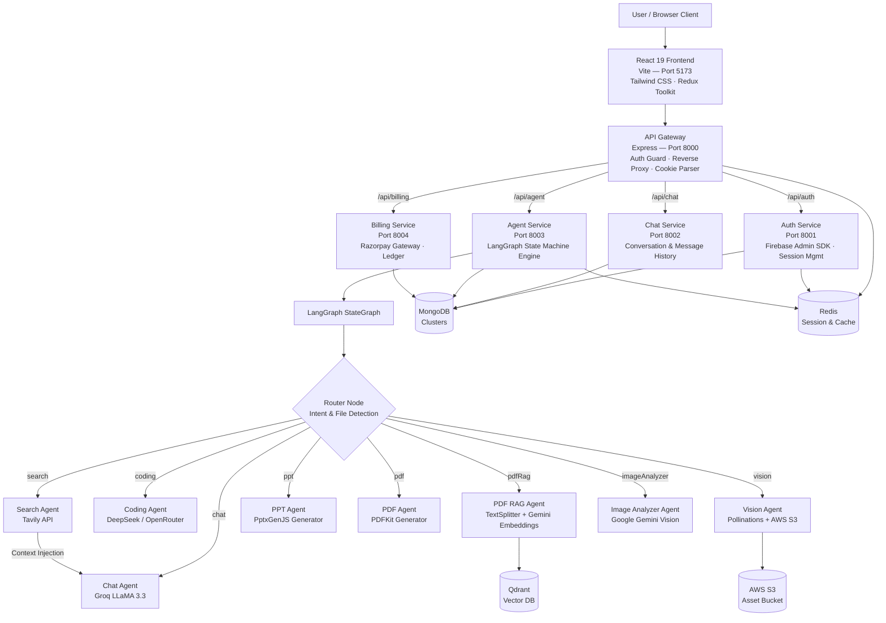
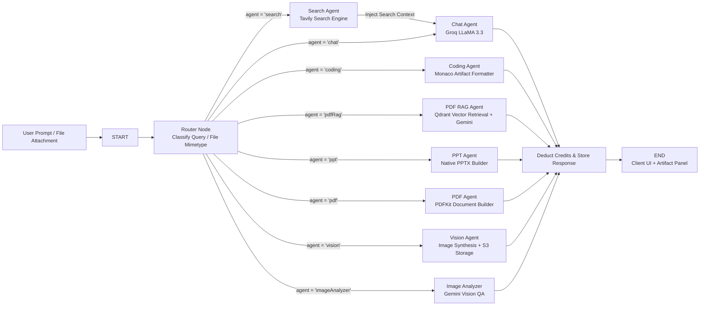

# 🧠 CortexAI

### Autonomous Multi-Agent AI Orchestration & Workspace Platform

A production-grade full-stack platform that unifies specialized AI agents into a single intelligent workspace — automatically routing complex user requests to dedicated agents for real-time web search, interactive Monaco code editing, vector-powered PDF RAG, automated PowerPoint and PDF document synthesis, image generation, and multi-modal visual analysis.

[](https://github.com/summar22/CortexAI)
[](https://react.dev)
[](https://nodejs.org)
[](https://langchain-ai.github.io/langgraph)
[](https://mongodb.com)
[](https://redis.io)
[](https://qdrant.tech)
[](https://razorpay.com)
[](LICENSE)

---

## ✨ Introduction

CortexAI is a **production-grade, microservices-driven AI ecosystem** engineered to eliminate fragmented AI tooling.

Rather than forcing users to juggle separate platforms for conversational chat, code generation, document question answering, presentation design, and image creation, CortexAI orchestrates an ensemble of specialized **LangGraph** agents under a single unified, reactive interface.

When a prompt or file is submitted, the platform's state machine dynamically routes the request: classification and general reasoning flow through high-throughput LLMs via Groq, coding prompts open live interactive artifacts in Monaco Editor, PDF uploads trigger semantic vector embeddings in Qdrant, presentation prompts synthesize native `.pptx` decks, and visual queries invoke multi-modal vision models.

Built with a distributed Express.js microservices backend, LangGraph state machine orchestration, Qdrant vector retrieval, MongoDB and Redis caching/session layer, AWS S3 asset persistence, and a React 19 + Tailwind CSS frontend.

---

## 💡 Why CortexAI?

The modern AI workflow is broken by fragmentation.

- **Context Switching Tax:** Users juggle 4 to 6 disparate tools — ChatGPT for text, Perplexity for search, Claude or Cursor for code, Midjourney for images, and specialized PDF tools for document interrogation.
- **Lost Context & Repetitive Prompting:** Knowledge generated in one window cannot easily be transferred to another without manual copy-pasting.
- **No Unified Artifact Experience:** Standard chat interfaces dump thousands of lines of raw code or markdown directly into the chat stream instead of isolating them into an interactive workspace.
- **Scattered Billing & Subscriptions:** Paying multiple standalone subscriptions is costly and cumbersome for teams and power users.

**CortexAI eliminates these boundaries.** It introduces an autonomous routing layer that inspects prompt semantics and file attachments, picks the exact right agent, streams the response, and renders code and generated files in dedicated split-view artifact panels.

The result is a fluid, all-in-one AI command center that compresses hours of multi-tool workflows into instant, single-turn interactions.

---

## 🚀 What Makes CortexAI Different?

### 🤖 Multi-Agent LangGraph StateGraph Architecture
Not a generic monolithic prompt — CortexAI operates on a compiled `StateGraph` workflow. Every incoming request hits a dedicated **Router Node** that evaluates intent, parameters, and uploaded file types. The state machine conditionally dispatches execution to one of eight specialized agent nodes (`chat`, `search`, `coding`, `pdfRag`, `pdf`, `ppt`, `vision`, `imageAnalyzer`), chaining downstream nodes (such as Tavily search results piped into conversational synthesis) before concluding.

### 💻 Interactive Monaco Code Studio & Artifacts
When coding prompts are detected, CortexAI doesn't just print markdown code blocks. It extracts clean, structured code artifacts and launches an interactive side-by-side **Monaco Editor** (`@monaco-editor/react`) — the same engine powering VS Code. Users can inspect syntax-highlighted code, copy with one click, or review multi-file snippets in a dedicated developer environment.

### 📚 Vector-Powered PDF RAG Engine
Upload any PDF document to automatically trigger a full Retrieval-Augmented Generation (RAG) pipeline. The PDF agent extracts textual content using `pdf-parse`, partitions it into semantic chunks with `RecursiveCharacterTextSplitter`, generates vector embeddings via Google Generative AI, indexes them in a **Qdrant cloud vector database**, and performs semantic similarity search to answer document questions with verifiable accuracy.

### 🌐 Real-Time Web Intelligence with Tavily
Queries requiring recent events, news, or internet lookups are routed through the **Search Agent** utilizing the **Tavily AI Search API**. Up-to-date web results and factual snippets are injected directly into the conversational agent's context window, delivering real-time factual accuracy without knowledge cutoff limitations.

### 📊 Native Presentation & PDF Document Synthesis
Need a slide deck or structured report? The **PPT Agent** leverages `pptxgenjs` to procedurally compile downloadable PowerPoint (`.pptx`) decks complete with styled slides, headers, and bulleted takeaways. Similarly, the **PDF Agent** utilizes `pdfkit` to generate downloadable formatted PDF summaries and documentation.

### 🎨 Multi-Modal Vision & Image Synthesis
Generate photorealistic visuals on-demand using Pollinations AI, with generated media optionally persisted to **AWS S3** with presigned retrieval URLs. For visual understanding, the **Image Analyzer Agent** uses Google Gemini multi-modal models to parse diagrams, screenshots, and photos with deep analytical reasoning.

### 💳 Token Credit Economy & Razorpay Monetization
A dedicated billing microservice manages a token-based economy. Users purchase token packs through a seamless **Razorpay** checkout drawer with secure HMAC-SHA256 signature verification, instant credit balance top-ups, and automatic token deduction per agent execution.

---

## 🌟 Core Features

| 🤖 Multi-Agent Orchestration | 💻 Code & Artifact Studio |
|---|---|
| Dynamic LangGraph `StateGraph` routing | Monaco Editor (VS Code engine) integration |
| Auto-intent classification or manual override | Syntax highlighting for 20+ languages |
| Search-to-chat context forwarding chain | Clean side-panel artifact inspector |
| Multi-modal file mimetype detection | Instant code copying & formatted view |
| Conversation history & state persistence | Structured multi-language code generation |

| 📚 Document RAG & Web Search | 🎨 Media, Documents & Billing |
|---|---|
| Qdrant Cloud vector search integration | PPTX slide deck generation via `pptxgenjs` |
| Chunking via `RecursiveCharacterTextSplitter` | PDF document export with `pdfkit` |
| Google GenAI vector embeddings | AI image generation + AWS S3 persistence |
| Live internet search via Tavily Search API | Multi-modal image analysis with Gemini |
| Fact-checked conversational synthesis | Razorpay payments & token credit ledger |

---

## 🏗 System Architecture



---

## 🤖 LangGraph Multi-Agent Workflow



---

## 🛠 Tech Stack

### Frontend
- **Framework:** React 19, Vite
- **Styling:** Tailwind CSS (v4), Motion (`motion/react`)
- **State Management:** Redux Toolkit (`@reduxjs/toolkit`), React Redux
- **Code Studio:** Monaco Editor (`@monaco-editor/react`)
- **Markdown & Syntax:** `react-markdown`, `remark-gfm`, `react-syntax-highlighter`
- **Icons & UI:** `lucide-react`, `react-icons`
- **Authentication:** Firebase Client SDK (Google Sign-In)
- **HTTP Client:** Axios with credentialed sessions

### Backend Microservices
- **Architecture:** Distributed Express.js Microservices with API Gateway
- **Reverse Proxy:** `express-http-proxy` with custom header forwarding
- **AI & Graph Orchestration:** LangChain Core, LangGraph (`@langchain/langgraph`), Groq SDK (`@langchain/groq`), Google GenAI (`@langchain/google-genai`), OpenRouter (`@langchain/openrouter`)
- **Vector Search & RAG:** Qdrant Vector Cloud (`@langchain/qdrant`), `@langchain/textsplitters`
- **Web Search Intelligence:** Tavily Search (`@langchain/tavily`)
- **Document & Slide Generation:** `pptxgenjs`, `pdfkit`, `pdf-parse`, `multer`
- **Databases & Cache:** MongoDB with Mongoose ODM, Redis (`ioredis`)
- **Cloud Storage:** AWS SDK v3 (`@aws-sdk/client-s3`, `@aws-sdk/s3-request-presigner`)
- **Payments:** Razorpay Node.js SDK

---

## 📁 Repository Structure

```
cortexAI/
├── backend/
│   ├── docker-compose.yml              # Redis container infrastructure
│   ├── gateway/                        # API Gateway — auth guard, reverse proxy & session
│   │   ├── controllers/                # User profile controller
│   │   ├── middleware/                 # Protect middleware & Redis cookie validation
│   │   ├── utils/                      # Header forwarding proxy utility
│   │   └── index.js                    # Gateway entry point (:8000)
│   ├── services/
│   │   ├── agent/                      # LangGraph Multi-Agent Engine (:8003)
│   │   │   ├── agents/                 # Chat, Search, Coding, PDF, PPT, Vision, RAG, Analyzer
│   │   │   ├── config/                 # LLM model registry & S3 configuration
│   │   │   ├── controllers/            # Agent execution & file upload handler
│   │   │   ├── graph/                  # StateGraph, Router node, and state schema
│   │   │   ├── routes/                 # Agent dispatch endpoints
│   │   │   └── utils/                  # S3 uploaders, helpers, and file parsers
│   │   ├── auth/                       # Firebase Auth & Redis session manager (:8001)
│   │   │   ├── controllers/            # Google login, logout, verification
│   │   │   ├── models/                 # User schema & credit balance
│   │   │   └── routes/                 # Auth API routes
│   │   ├── billing/                    # Razorpay orders & credit ledger (:8004)
│   │   │   ├── controllers/            # Order creation & signature verification
│   │   │   ├── models/                 # Transaction schema
│   │   │   └── routes/                 # Billing API endpoints
│   │   └── chat/                       # Conversations & Message persistence (:8002)
│   │       ├── controllers/            # Conversation CRUD & message retrieval
│   │       ├── models/                 # Conversation & Message schemas
│   │       └── routes/                 # Chat API endpoints
│   └── shared/                         # Cross-service shared utilities
└── frontend/
    ├── public/                         # Static assets & favicon
    └── src/
        ├── assets/                     # Logos, branding & UI graphics
        ├── components/
        │   ├── Artifact.jsx            # Monaco editor & generated document artifact preview
        │   ├── BillingDrawer.jsx       # Razorpay token package checkout drawer
        │   ├── ChatArea.jsx            # Active conversation container
        │   ├── ChatInput.jsx           # Prompt input, model selector & file attachments
        │   ├── LoadingAnimation.jsx    # Pulsing agent thought indicator
        │   ├── MessageBubble.jsx       # Formatted markdown messages & citations
        │   ├── MessageList.jsx         # Virtualized chat scroll history
        │   ├── Nav.jsx                 # Top bar with credit counter & user avatar
        │   └── SideBar.jsx             # Conversation history, new chat, & settings
        ├── features/                   # Modular API service handlers
        ├── pages/
        │   └── Home.jsx                # Main split-view workspace
        ├── redux/                      # Redux Toolkit store (user, conversation, message)
        └── App.jsx                     # Root component & auth provider
```

---

## ⚡ Getting Started

### Prerequisites
- Node.js v18+ & npm
- Docker (for Redis cache) or a running local Redis instance
- MongoDB Atlas cluster or local MongoDB instance
- Groq Cloud API Key — [console.groq.com](https://console.groq.com)
- Google Gemini API Key — [aistudio.google.com](https://aistudio.google.com)
- Tavily AI Search API Key — [tavily.com](https://tavily.com)
- Qdrant Cloud Cluster & API Key — [cloud.qdrant.io](https://cloud.qdrant.io)
- Firebase Project with Google Sign-In — [firebase.google.com](https://firebase.google.com)
- Razorpay Account (Test Mode) — [razorpay.com](https://razorpay.com)
- AWS S3 Bucket *(Optional, for persistent image hosting)*

---

### 1. Clone the Repository
```bash
git clone https://github.com/summar22/CortexAI.git
cd CortexAI
```

### 2. Configure Environment Variables
Create `.env` configuration files for each service and frontend:

```bash
# Gateway
cp backend/gateway/.env.example backend/gateway/.env

# Backend Services
cp backend/services/auth/.env.example backend/services/auth/.env
cp backend/services/chat/.env.example backend/services/chat/.env
cp backend/services/agent/.env.example backend/services/agent/.env
cp backend/services/billing/.env.example backend/services/billing/.env

# Frontend
cp frontend/.env.example frontend/.env
```

### 3. Start Infrastructure (Redis)
```bash
cd backend
docker-compose up -d
cd ..
```

### 4. Run Backend Microservices
Open separate terminal tabs or run concurrently:

```bash
# API Gateway (:8000)
cd backend/gateway && npm install && npm run dev

# Auth Service (:8001)
cd backend/services/auth && npm install && npm run dev

# Chat Service (:8002)
cd backend/services/chat && npm install && npm run dev

# Agent Service (:8003)
cd backend/services/agent && npm install && npm run dev

# Billing Service (:8004)
cd backend/services/billing && npm install && npm run dev
```

### 5. Run Frontend
```bash
cd frontend
npm install
npm run dev
```

Navigate to [http://localhost:5173](http://localhost:5173) in your browser.

---

## 🔒 Environment Variables Reference

| Variable | Service | Description |
|---|---|---|
| `PORT` | All Services | Port number the microservice listens on |
| `MONGODB_URI` | Auth, Chat, Agent, Billing | MongoDB connection connection string |
| `REDIS_URL` | Gateway, Auth, Agent | Redis cache & session store connection URL |
| `FRONTEND_URL` | Gateway | Client origin URL for CORS policy (`http://localhost:5173`) |
| `AUTH_SERVICE` | Gateway, Agent, Billing | Internal URL for Auth Service (`http://localhost:8001`) |
| `CHAT_SERVICE` | Gateway, Agent | Internal URL for Chat Service (`http://localhost:8002`) |
| `AGENT_SERVICE` | Gateway | Internal URL for Agent Service (`http://localhost:8003`) |
| `BILLING_SERVICE` | Gateway | Internal URL for Billing Service (`http://localhost:8004`) |
| `GROQ_API_KEY` | Agent | Groq inference API key for ultra-fast LLaMA models |
| `GOOGLE_API_KEY` | Agent | Google Gemini API key for embeddings and vision |
| `TAVILY_API_KEY` | Agent | Tavily Search API key for real-time web lookups |
| `OPENROUTER_API_KEY` | Agent | OpenRouter API key for DeepSeek coding models |
| `QDRANT_URL` | Agent | Qdrant Cloud cluster endpoint |
| `QDRANT_API_KEY` | Agent | Qdrant Cloud API authentication key |
| `AWS_REGION` | Agent | AWS region for S3 image bucket (e.g., `ap-south-1`) |
| `AWS_ACCESS_KEY_ID` | Agent | AWS IAM access key ID |
| `AWS_SECRET_KEY` | Agent | AWS IAM secret key |
| `AWS_BUCKET_NAME` | Agent | Target AWS S3 bucket name |
| `RAZORPAY_KEY_ID` | Billing, Frontend | Razorpay public key ID |
| `RAZORPAY_KEY_SECRET` | Billing | Razorpay secret key for payment verification |
| `VITE_FIREBASE_API_KEY`| Frontend | Firebase Web API key for Google authentication |
| `VITE_SERVER_URL` | Frontend | API Gateway base URL (`http://localhost:8000`) |
| `VITE_RAZORPAY_KEY_ID`| Frontend | Razorpay client key ID for checkout drawer |

---

## 📜 License

Distributed under the MIT License. See `LICENSE` for more information.

---

Built with ❤️ by [summar22](https://github.com/summar22)
